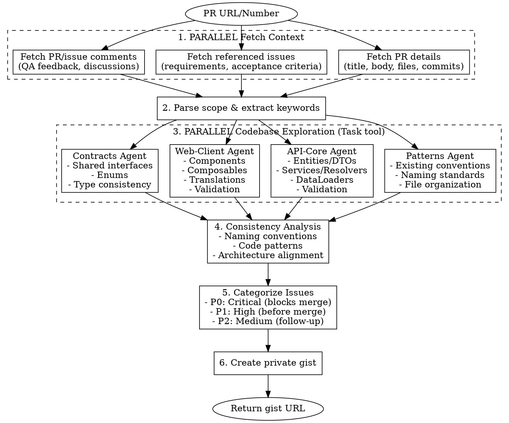
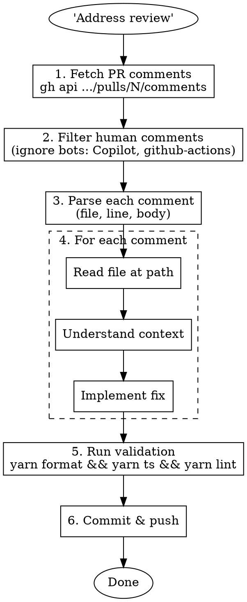

# Review PR

Deep-dive PR analysis with parallel codebase exploration, consistency checking, and private gist output.

Also supports **addressing human review comments** - filtering out AI/bot reviewers and implementing only human feedback.

## Overview

### Mode 1: Generate PR Review
Systematically review PRs by:
1. Fetching PR details and referenced issues from GitHub
2. Launching parallel exploration agents across all affected packages
3. Analyzing consistency with existing codebase patterns
4. Categorizing issues by severity (P0/P1/P2)
5. Creating a shareable private gist with full analysis

### Mode 2: Address Human Review Comments
When asked to "address review", "fix review comments", or "address human review":
1. Fetch all PR review comments from GitHub API
2. Filter out bot/AI reviewers (Copilot, github-actions, etc.)
3. Address only human reviewer feedback
4. Run validation and commit changes

## Workflow



## Step-by-Step

### 1. Fetch PR Context (PARALLEL)

Use a SINGLE message with MULTIPLE tool calls:

```bash
# PR details
gh pr view <NUMBER> --json title,body,commits,files,comments,reviews,labels,state,headRefName,baseRefName

# Referenced issues (parse from PR body "fixes #XXXX")
gh issue view <ISSUE_NUMBER> --json title,body,comments,labels,state

# Get diff stats
gh pr diff <NUMBER> --stat
```

### 2. Parse Scope & Extract Keywords

From PR body and commits, identify:
- **Feature scope**: What's being added/changed
- **Affected packages**: api-core, web-client, mobile-client, api-contracts
- **Key entities**: New models, components, services
- **Referenced issues**: Requirements and acceptance criteria
- **QA feedback**: Bug reports from comments

### 3. Launch Parallel Exploration Agents

**CRITICAL**: Use a SINGLE message with MULTIPLE Task tool calls for true parallelism.

#### Agent 1: Existing Patterns Analysis

```
Explore the codebase to understand existing patterns for consistency comparison.

Focus on:
1. Component organization in affected modules
2. File naming conventions (kebab-case, suffixes)
3. Interface/type naming (*Interface, *Enum suffixes)
4. Composable patterns (use-* prefix)
5. Constant patterns (get-*.constant.ts)
6. Validation schema patterns (Zod)
7. Translation key structure
8. Similar features already implemented

Report the established conventions that the PR should follow.
```

#### Agent 2: API-Core Analysis

```
Analyze the API changes in the PR for the <feature> feature.

Check:
1. Entity structure - columns, relations, constraints
2. DTO completeness - all fields exposed correctly
3. Service patterns - @Transactional, @Log decorators
4. Resolver structure - guards, pipes, access control
5. DataLoader implementation - REQUEST scope, batching
6. Validation - class-validator constraints
7. CQRS patterns - commands, events, sagas
8. Migration safety - up/down consistency

Compare against existing patterns in similar modules.
```

#### Agent 3: Web-Client Analysis

```
Analyze the web-client changes in the PR for the <feature> feature.

Check:
1. Component structure - hierarchy, naming
2. Composable patterns - return types, reactivity
3. Validation schemas - Zod patterns, error messages
4. Translation completeness - all strings in en.json
5. Form handling - v-model, validation state
6. State management - Pinia patterns if used
7. GraphQL fragments - completeness, nesting
8. Styling - BEM naming, CSS variables

Compare against existing patterns in @rule-entry, @generic, @procedures.
```

#### Agent 4: Contracts Analysis

```
Analyze api-contracts changes for the <feature> feature.

Check:
1. Interface naming - *Interface suffix
2. Enum naming - *Enum suffix
3. Type exports - proper barrel exports
4. Consistency - web and API using same types
5. Optional vs required fields alignment
```

### 4. Consistency Analysis

Compare PR implementation against discovered patterns:

| Category | Existing Pattern | PR Implementation | Status |
|----------|------------------|-------------------|--------|
| File naming | `kebab-case.type.ts` | ? | ✅/⚠️ |
| Interface naming | `*Interface` suffix | ? | ✅/⚠️ |
| Component structure | Hierarchical folders | ? | ✅/⚠️ |
| Validation | Zod with translation keys | ? | ✅/⚠️ |
| Translations | Namespaced keys | ? | ✅/⚠️ |

### 5. Categorize Issues

#### P0 - Critical (Blocks Merge)
- API crashes/errors
- Security vulnerabilities
- Data corruption risks
- Breaking changes without migration

#### P1 - High (Before Merge)
- Consistency violations with existing patterns
- Missing validation
- QA-reported bugs affecting core functionality
- Incomplete translations
- Spec compliance issues

#### P2 - Medium (Follow-up Tickets)
- Edge case handling
- UX improvements
- Performance optimizations
- Code style preferences

### 6. Create Private Gist

```bash
gh gist create -d "PR #<NUM>: <Title> - Review" analysis.md
```

## Gist Template

```markdown
# PR #<NUM>: <Title>

## Overview

**PR:** <url>
**Issue:** <referenced issue url>
**Branch:** `<branch name>`
**Files Changed:** <count>
**Author:** @<username>

### Feature Summary
<1-3 sentence description of what the PR implements>

---

## Architecture

### Data Model
\`\`\`
<ASCII diagram of entities/relationships>
\`\`\`

### Component Structure
\`\`\`
<directory tree of new components>
\`\`\`

### New Files Summary
| Package | New Files | Purpose |
|---------|-----------|---------|
| api-core | X | <summary> |
| web-client | X | <summary> |
| api-contracts | X | <summary> |

---

## QA Issues Analysis

| # | Issue | Severity | Category | Status |
|---|-------|----------|----------|--------|
| 1 | <description> | P0/P1/P2 | <category> | Open/Fixed |

---

## Consistency Analysis

### ✅ Following Existing Patterns
<list of things done correctly>

### ⚠️ Consistency Issues Found

#### 1. <Issue Title>
**Location:** `<file path>`
**Problem:** <description>
**Existing Pattern:** <how it's done elsewhere>
**Fix:**
\`\`\`typescript
<code fix>
\`\`\`

---

## Recommendations

### P0 - Critical (Block Merge)
1. <issue with fix>

### P1 - High (Before Merge)
1. <issue with fix>

### P2 - Medium (Follow-up)
1. <issue>

---

## Files Changed Summary

### API Core (<count> files)
**New:**
- `<path>` - <purpose>

**Modified:**
- `<path>` - <changes>

### Web Client (<count> files)
**New:**
- `<path>` - <purpose>

**Modified:**
- `<path>` - <changes>

### API Contracts (<count> files)
- `<path>` - <purpose>

---

## Testing Recommendations

### Integration Tests
- [ ] <specific test scenario>

### E2E Tests
- [ ] <specific test scenario>

---

## Summary

<2-3 sentences with overall assessment and key recommendations>

**Recommendation:** Approve / Request Changes / Needs Discussion

---

*Review generated: <date>*
```

## Consistency Checklist

### Naming Conventions

| Element | Convention | Example |
|---------|------------|---------|
| Vue components | `kebab-case.vue` | `rule-entry-builder.vue` |
| TypeScript files | `kebab-case.type.ts` | `rule-entry-data.interface.ts` |
| Interfaces | `*Interface` suffix | `RuleEntryDataInterface` |
| Enums | `*Enum` suffix | `RuleEntryTypeEnum` |
| Composables | `use-*.ts` | `use-rule-entry-form.ts` |
| Constants | `*.constant.ts` or `get-*.constant.ts` | `get-empty-state.constant.ts` |
| Mappers | `map-*-to-*.mapper.ts` | `map-dto-to-data.mapper.ts` |
| Schemas | `*.schema.ts` | `rule-entry-input.schema.ts` |
| Fragments | `*.fragment.ts` | `rule-entry.fragment.ts` |

### Code Patterns

| Pattern | Check |
|---------|-------|
| No `as` type assertions | Look for `as` keyword |
| No eslint-disable | Look for `eslint-disable` |
| No comments in code | Look for `//` comments |
| Type guards from @rnw-community | `isDefined()`, `isNotEmptyArray()` |
| Translations in en.json | No hardcoded strings |
| One export per file | Check barrel exports |
| Max 310 lines per file | Check file length |
| No lodash | Use native JS |
| Vue 3 Composition API only | No Options API |

### API Patterns

| Pattern | Check |
|---------|-------|
| `@Transactional()` on create/update/delete | Services that write |
| `@Log()` decorator | All service methods |
| REQUEST scope for DataLoaders | `@Injectable({ scope: Scope.REQUEST })` |
| Access services for permissions | `*AccessService` |
| Feature flag guards | `@HasFeatureFlags()` |

### Web Patterns

| Pattern | Check |
|---------|-------|
| `defineModel()` for two-way binding | Form components |
| Scoped SCSS | `<style scoped lang="scss">` |
| BEM naming | `.block__element--modifier` |
| CSS variables | `var(--gap-m)`, `var(--c-primary)` |
| Deep copy for objects | `deepCopy(toRaw(value))` |

## Common Issues to Flag

| Issue | Why It Matters |
|-------|----------------|
| Hardcoded brand name | White-label customers see wrong branding |
| Missing default values | Spec compliance, UX consistency |
| Unsorted dropdown options | UX consistency across app |
| Validation inconsistency | Different limits in similar features |
| Array index vs display number | Off-by-one bugs on delete |
| Missing mutual exclusivity | Logic bugs allowing invalid states |
| Dynamic text not using context | "maintenance" vs "check" based on type |

## Example Invocation

```
User: /review-pr 17162

Claude:
1. Fetches PR #17162 details (title, body, files, commits)
2. Fetches issue #15549 (referenced in PR body)
3. Parses: Schedule configuration for rule entries, 100 files
4. Launches 4 parallel agents:
   - Patterns: Discovers @rule-entry conventions
   - API: Reviews entities, services, resolvers
   - Web: Reviews components, composables, translations
   - Contracts: Reviews interfaces, enums
5. Consistency analysis: Finds 9 issues
6. Categorizes: 3 P0, 6 P1, 3 P2
7. Creates gist with full analysis
8. Returns: https://gist.github.com/...
```

## Tips

- **Always check QA comments** - They contain real-world bug reports
- **Compare with similar features** - @rule, @procedures have similar patterns
- **Check translations** - Missing keys cause runtime errors
- **Verify default values** - Spec often specifies defaults
- **Look for hardcoded values** - Brand names, magic numbers
- **Check mutual exclusivity** - Radio-like choices shouldn't allow multiple
- **Verify sorting** - Dropdowns usually alphabetically sorted
- **Test edge cases** - Day 31 in February, etc.

---

## Addressing Human Review Comments

When asked to "address review", "fix review comments", or "address human review", follow this workflow:

### 1. Fetch Review Comments

```bash
# Get PR review state
gh pr view <NUMBER> --json number,url,reviews --jq '{number, url, reviews: [.reviews[] | {author: .author.login, state: .state, body: .body}]}'

# Get all review comments (inline comments on code)
gh api repos/<OWNER>/<REPO>/pulls/<NUMBER>/comments
```

### 2. Filter Human vs Bot Comments

**CRITICAL**: Only address comments from human reviewers. Ignore AI/bot reviewers unless explicitly asked.

**Known Bot/AI Reviewers to Ignore:**
- `Copilot` / `copilot-pull-request-reviewer`
- `github-actions[bot]`
- `dependabot[bot]`
- `claude-review` / any `*-review` bot
- Any user with `type: "Bot"` in the API response

**Human Review Indicators:**
- `user.type === "User"` (not "Bot")
- Real usernames (not ending in `[bot]`)
- Review state is `CHANGES_REQUESTED` or `APPROVED` from humans

### 3. Parse Human Comments

For each human comment, extract:
- **File path**: `comment.path`
- **Line number**: `comment.line` or `comment.original_line`
- **Comment body**: `comment.body`
- **Author**: `comment.user.login`

### 4. Address Each Comment

For each human review comment:

1. **Read the file** at the specified path
2. **Understand the context** around the line number
3. **Implement the requested change**
4. **Run validation** (`yarn format && yarn ts && yarn lint && yarn deadcode && yarn cpd`)

### 5. Commit and Push

After addressing all comments:

```bash
git add <changed files>
git commit -m "$(cat <<'EOF'
fix(<scope>): address PR review comments

- <summary of change 1>
- <summary of change 2>

Generated with [Claude Code](https://claude.ai/code)
via [Happy](https://happy.engineering)

Co-Authored-By: Claude <noreply@anthropic.com>
Co-Authored-By: Happy <yesreply@happy.engineering>
EOF
)"
git push
```

### Example: Filtering Human Comments

```bash
# Raw API call
gh api repos/owner/repo/pulls/123/comments

# Response includes both bot and human comments:
# - Copilot (bot): "Consider validating numeric fields..."
# - liaugust (human): "Enum instead"  <-- ADDRESS THIS
# - github-actions[bot]: "Coverage report..."

# Only address the human comment from liaugust
```

### Common Human Review Patterns

| Comment | Typical Fix |
|---------|-------------|
| "Enum instead" | Replace string literal with enum |
| "No need for this" | Remove the unnecessary code/comment |
| "Extract to constant" | Move value to `constant/` folder |
| "Use existing util" | Replace with existing utility function |
| "Missing translation" | Add i18n wrapper |
| "Type assertion" | Remove `as` and fix properly |

### Workflow Diagram


